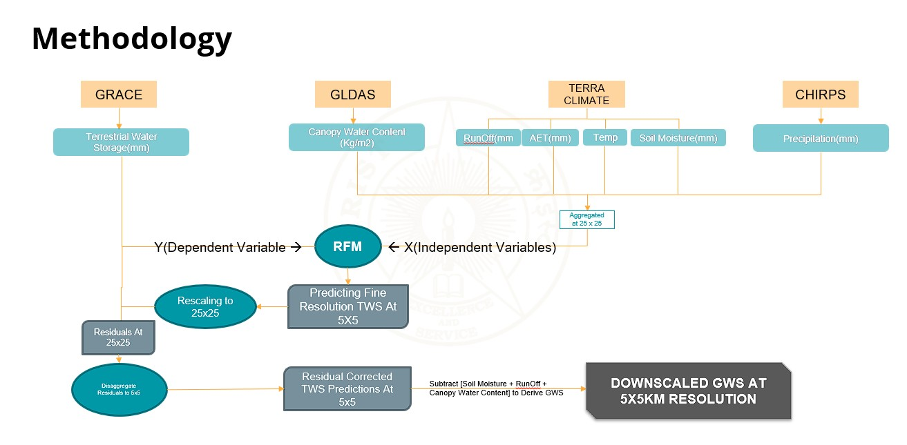

# Downscaling GRACE Data Using Random Forest for Spatio-Temporal Groundwater Storage Assessment in Rajasthan 🌍💧

> **By Alwyn Antony Ben**  
> BSc Data Science | CHRIST (Deemed to be University), Pune Lavasa Campus  
> Internship at ISRO – RRSC West, Jodhpur (Jan 2025 – Apr 2025)

---

## 📘 Project Overview

This project, conducted during my research internship at ISRO's RRSC-West (Jodhpur), aims to enhance the spatial resolution of GRACE (Gravity Recovery and Climate Experiment) satellite data using machine learning techniques—specifically, a Random Forest Regression model.

### ✅ Objective:
To downscale GRACE-derived Terrestrial Water Storage (TWS) data from **25 km resolution to 5 km**, and derive **Groundwater Storage (GWS)** estimates for the state of Rajasthan, India—supporting sustainable groundwater management in an arid region facing water stress.

---

## 🔍 Problem Statement

GRACE satellite data provides invaluable insights into large-scale groundwater anomalies. However, its **coarse spatial resolution (~100 km)** limits usability for **local-scale water resource management**.

This project develops a robust machine learning framework to:

- Downscale GRACE/TWS data to finer resolutions
- Integrate high-resolution hydroclimatic auxiliary datasets
- Derive accurate groundwater storage estimates at 5 km scale
- Perform temporal analysis of groundwater change (2003–2023)


---

## 🧠 Methodology



### 1. **Data Acquisition & Preprocessing**
- **Primary Variable (Y)**: 
  - GRACE-derived **TWS** (GLDAS V2.2, 25 km)
- **Auxiliary Variables (X)**:
  - Precipitation: CHIRPS (5 km)
  - Soil Moisture, Runoff, AET, Temperature: TerraClimate (4 km)
  - Canopy Water Content: GLDAS (25 km)

  


> Data converted from `.tif` and `.nc` to flat CSVs with geospatial integrity using `GDAL`, `Xarray`, `Rasterio`, and `GeoPandas`.

### 2. **Data Cleaning & Interpolation**
- Spatial interpolation using **Inverse Distance Weighting (IDW)**
- Temporal interpolation using average of previous and next months
- NaN values clipped outside the Rajasthan AOI


### 3. **Feature Engineering**
- Cyclical encoding for `Month` (sine & cosine transformation)
- Merging multi-source time-series into a harmonized DataFrame


### 4. **Model Development**
- Algorithm: **Random Forest Regressor**
- Validation: **10-fold Cross Validation**
- Tuning: **RandomizedSearchCV**
- Output: **Predicted TWS at 5 km**

### 5. **Residual Correction & GWS Derivation**
- Residuals between predicted TWS and aggregated input
- GWS = TWS - (Soil Moisture + Runoff + Canopy Water Content)


---

## 📊 Results

| Metric     | Value        |
|------------|--------------|
| R² Score   | 0.86         |
| RMSE       | 165 mm       |
| NSE        | 0.733        |
| Correlation | 84.68%      |

- **Final TWS and GWS maps** generated at **5 km resolution**
- **Temporal groundwater change trends** visualized for 2003–2023
.png>)
- Over **95% of Rajasthan shows groundwater decline**
.png>)


---

## 🧰 Tech Stack

- **Programming Language**: Python 3.9
- **Libraries Used**:
  - `scikit-learn`, `pandas`, `numpy`, `xarray`, `gdal`, `rasterio`, `matplotlib`, `geopandas`, `shapely`
- **GIS Tools**: QGIS, Google Earth Engine
- **Satellite Data Sources**:
  - GRACE, GLDAS, CHIRPS, TerraClimate

---

## 📂 Repository Structure

```
DOWNSCALING-OF-GRACE-DATA-USING-RF/
│
├── 📁 Model_Predictions/    # Contains model output predictions (CSV, TIF, NC)
├── 📁 notebooks/            # Jupyter Notebooks for each phase
├── 📁 visualizations/       # Output maps and trend plots
├── 📜 requirements.txt      # Required Python libraries
└── 📄 README.md             # You are here!
```


## 🌱 Learning Outcomes

- Hands-on expertise in handling **satellite-based geospatial datasets**
- Strong foundation in **machine learning for Earth observation**
- Developed full-cycle pipeline for **data cleaning, modeling, prediction, and visualization**
- Learned **interdisciplinary application** of data science in hydrogeology

---

## 🤝 Acknowledgements

This project was completed under the guidance of:

- **Mr. Sagar S. Salunkhe**, Scientist, RRSC-West, ISRO  
- **Mr. Manish Kumar Verma**, Scientist, RRSC-West, ISRO  


Special thanks to ISRO's RRSC-Jodhpur for their invaluable mentorship and support.

---

## 📫 Contact

For queries, collaborations, or feedback:  
**Email:** [alwynantonyben@gmail.com](mailto:alwynantonyben@gmail.com)  
**LinkedIn:** [www.linkedin.com/in/alwyn-antony-ben](www.linkedin.com/in/alwyn-antony-ben)

---

> “To continue to be in the forefront of developing remote sensing applications in the country and be the technology expert in establishing ground stations and generating high quality satellite and aerial data products”  
> – *NRSC*
